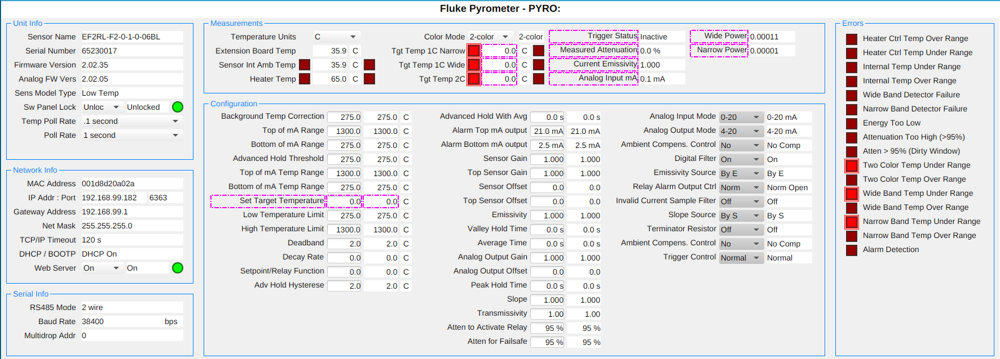

# flukePyrometer

An [EPICS](https://epics-controls.org) [StreamDevice](https://paulscherrerinstitute.github.io/StreamDevice/)
IOC for [Fluke](https://www.flukeprocessinstruments.com/en-us)
[Endurance Series Pyrometers](https://www.flukeprocessinstruments.com/en-us/products/infrared-temperature-solutions/spot-pyrometers/endurance).
A manual can be found in the [docs](docs/9250804_ENG_B_W.pdf) folder
([source](https://assets.flukeprocessinstruments.com/FindIt/9250804_ENG_B_W.pdf)).

## EPICS Dependencies

* [base](https://github.com/epics-base/epics-base)
* [asyn](https://github.com/epics-modules/asyn)
* [autosave](https://github.com/epics-modules/autosave)
* [StreamDevice](https://github.com/paulscherrerinstitute/StreamDevice)

## Theory of Operation

The driver sets the polling mode to "Poll" (instead of "Burst") and then polls the device at the specified poll rates.
The poll rates are specified via the `SCAN` fields of two Process Variables:

* `$(P)$(R)TempPollRate.SCAN`: Poll Rate for all temperature readings (default: ".1 second")
* `$(P)$(R)PollRate.SCAN`: Poll Rate for all other readings (default: "1 second")

All set/get operations are done using the ASCII commands supported by the device.
Commnication is established using `asyn` to connect to the device's listening port (default: port 6363).

## Adding new commands

This driver's code is structured in a way to make adding new commands easy. There's one template file for each supported type of parameter:

* `enum.template`: parameters with multiple-choice value
* `float.template`: parameters with floating point value
* `temperature.template`: temperature parameters (temperature units are controlled via the `$(P)$(R)Units` PV)
* `string.template`: parameters with string value

There are two additional template files:

* `base.template` specifies a few records that don't fit neatly into one of the categories above
* `errorbit.template` is used to have one individual record per error bit (as read in `$(P)$(R)ErrorCodes_RBV`)

Records are then created in the `flukePyrometer.substitutions` file, which loads the templates above as needed.
Adding new parameters is just a matter of extending the substitutions file. The substitutions file is ultimately compiled into `$(TOP)/db/flukePyrometer.db`.

### Autosave

Autosave for any of the normal records can be controlled via the `AS` column in the substitutions file:

* If the column is set to `"#"`, autosave is not enabled for that record.
* If the column is set to `""`, autosave is enabled for that record's `VAL` field.

## Operator Interface

A [Phoebus](https://controlssoftware.sns.ornl.gov/css_phoebus/) `.bob` file is available under the `op/bob` folder.

## Process Variables

All Process Variables are prefixed by `$(P)$(R)`, which can be specified in `st.cmd` at startup.

| Names                                         | ASCII Command | Record Types   | Description                                                                               |
|-----------------------------------------------|---------------|----------------|-------------------------------------------------------------------------------------------|
| `TempPollRate`                                |               | `event`        | Temperature Poll Rate - how often to poll for temperature readings (`SCAN` field)         |
| `PollRate`                                    |               | `event`        | Poll Rate - how often to poll for other readings (`SCAN` field)                           |
| `PollBurstMode`                               | `V`           | `bo`           | Whether to poll the device or to listen to bursts. By default, set to Poll                |
| `ErrorCodes_RBV`                              | `EC`          | `mbbiDirect`   | Currently Active Error Codes. This is broken down into individual `bi` records as follows |
| `HeatCtlTempOverRng_RBV`                      | `EC`          | `bi`           | Heater Ctrl Temp Over Range                                                               |
| `HeatCtlTempUnderRng_RBV`                     | `EC`          | `bi`           | Heater Ctrl Temp Under Range                                                              |
| `InternTempUnderRng_RBV`                      | `EC`          | `bi`           | Internal Temp Under Range                                                                 |
| `InternTempOverRng_RBV`                       | `EC`          | `bi`           | Internal Temp Over Range                                                                  |
| `WideBandDetFail_RBV`                         | `EC`          | `bi`           | Wide Band Detector Failure                                                                |
| `NarrBandDetFail_RBV`                         | `EC`          | `bi`           | Narrow Band Detector Failure                                                              |
| `EnergyTooLow_RBV`                            | `EC`          | `bi`           | Energy Too Low                                                                            |
| `AttenTooHigh_RBV`                            | `EC`          | `bi`           | Attenuation Too High (>95%)                                                               |
| `AttenOver95Pct_RBV`                          | `EC`          | `bi`           | Atten > 95% (Dirty Window)                                                                |
| `TwoCTempUnderRng_RBV`                        | `EC`          | `bi`           | Two Color Temp Under Range                                                                |
| `TwoCTempOverRng_RBV`                         | `EC`          | `bi`           | Two Color Temp Over Range                                                                 |
| `WideBandTempUnderRng_RBV`                    | `EC`          | `bi`           | Wide Band Temp Under Range                                                                |
| `WideBandTempOverRng_RBV`                     | `EC`          | `bi`           | Wide Band Temp Over Range                                                                 |
| `NarrBandTempUnderRng_RBV`                    | `EC`          | `bi`           | Narrow Band Temp Under Range                                                              |
| `NarrBandTempOverRng_RBV`                     | `EC`          | `bi`           | Narrow Band Temp Over Range                                                               |
| `AlarmDetection_RBV`                          | `EC`          | `bi`           | Alarm Detection                                                                           |
| `GatewayAddress_RBV`                          | `GW`          | `stringin`     | Gateway Address                                                                           |
| `IPAddress_RBV`                               | `IP`          | `stringin`     | IP Address                                                                                |
| `MACAddress_RBV`                              | `MAC`         | `stringin`     | MAC Address                                                                               |
| `NetMask_RBV`                                 | `NM`          | `stringin`     | Net Mask                                                                                  |
| `IPPort_RBV`                                  | `PORT`        | `stringin`     | IP Port                                                                                   |
| `FirmwareRevision_RBV`                        | `XR`          | `stringin`     | Firmware Revision Number                                                                  |
| `AnalogFwRev_RBV`                             | `XRA`         | `stringin`     | Analog Firmware Revision                                                                  |
| `SensorName_RBV`                              | `XU`          | `stringin`     | Sensor Name                                                                               |
| `SensorSerialNum_RBV`                         | `XV`          | `stringin`     | Sensor Serial Number                                                                      |
| `AmbCompsCtrl_RBV`, `AmbCompsCtrl`            | `AC`          | `mbbi`, `mbbo` | Ambient Compens. Control                                                                  |
| `DigitalFilter_RBV`, `DigitalFilter`          | `DF`          | `mbbi`, `mbbo` | Digital Filter                                                                            |
| `DhcpBootp_RBV`                               | `DHCP`        | `mbbi`         | DHCP / BOOTP                                                                              |
| `EmissSource_RBV`, `EmissSource`              | `ES`          | `mbbi`, `mbbo` | Emissivity Source                                                                         |
| `RS485Mode_RBV`                               | `HM`          | `mbbi`         | RS485 Mode                                                                                |
| `AnalogInpMode_RBV`, `AnalogInpMode`          | `INM`         | `mbbi`, `mbbo` | Analog Input Mode                                                                         |
| `SwPanelLock_RBV`, `SwPanelLock`              | `J`           | `mbbi`, `mbbo` | Switch Panel Lock                                                                         |
| `RelayAlrmOutCtrl_RBV`, `RelayAlrmOutCtrl`    | `K`           | `mbbi`, `mbbo` | Relay Alarm Output Ctrl                                                                   |
| `ColorMode_RBV`, `ColorMode`                  | `M`           | `mbbi`, `mbbo` | Color Mode                                                                                |
| `OutputFormat_RBV`, `OutputFormat`            | `OIF`         | `mbbi`, `mbbo` | Output Format                                                                             |
| `AlarmSource_RBV`, `AlarmSource`              | `SAS`         | `mbbi`, `mbbo` | Alarm Source                                                                              |
| `InvalidCurSmpFlt_RBV`, `InvalidCurSmpFlt`    | `SF`          | `mbbi`, `mbbo` | Invalid Current Sample Filter                                                             |
| `SlopeSource_RBV`, `SlopeSource`              | `SS`          | `mbbi`, `mbbo` | Slope Source                                                                              |
| `TermResistor_RBV`, `TermResistor`            | `TR`          | `mbbi`, `mbbo` | Terminator Resistor                                                                       |
| `Units_RBV`, `Units`                          | `U`           | `mbbi`, `mbbo` | Temperature Units                                                                         |
| `WebServer_RBV`, `WebServer`                  | `WS`          | `mbbi`, `mbbo` | WebServer                                                                                 |
| `SensorInit_RBV`, `SensorInit`                | `XI`          | `mbbi`, `mbbo` | Sensor Initialization                                                                     |
| `SensorModelType_RBV`                         | `XM`          | `mbbi`         | Sensor Model Type                                                                         |
| `AnalogOutMode_RBV`, `AnalogOutMode`          | `XO`          | `mbbi`, `mbbo` | Analog Output Mode                                                                        |
| `TriggerStatus_RBV`                           | `XT`          | `mbbi`         | Trigger Status                                                                            |
| `TriggerControl_RBV`, `TriggerControl`        | `XTC`         | `mbbi`, `mbbo` | Trigger Control                                                                           |
| `BaudRate_RBV`                                | `D`           | `mbbi`         | Baud Rate (bps)                                                                           |
| `BgTempCorr_RBV`, `BgTempCorr`                | `A`           | `ai`, `ao`     | Background Temp Correction                                                                |
| `TopOfmARange_RBV`, `TopOfmARange`            | `AH`          | `ai`, `ao`     | Top of mA Range                                                                           |
| `BotOfmARange_RBV`, `BotOfmARange`            | `AL`          | `ai`, `ao`     | Bottom of mA Range                                                                        |
| `AdvHoldThres_RBV`, `AdvHoldThres`            | `C`           | `ai`, `ao`     | Advanced Hold Threshold                                                                   |
| `ExtBoardTemp_RBV`                            | `EBT`         | `ai`           | Extension Board Temperature                                                               |
| `TopOfmATempRange_RBV`, `TopOfmATempRange`    | `H`           | `ai`, `ao`     | Top of mA Temp Range                                                                      |
| `BotOfmATempRange_RBV`, `BotOfmATempRange`    | `L`           | `ai`, `ao`     | Bottom of mA Temp Range                                                                   |
| `SensIntAmbTemp_RBV`                          | `I`           | `ai`           | Sensor Internal Amb Temp                                                                  |
| `TargetTemp1CNarr_RBV`                        | `N`           | `ai`           | Target Temp 1C Narrow                                                                     |
| `TargetTemp1CWide_RBV`                        | `W`           | `ai`           | Target Temp 1C Wide                                                                       |
| `TargetTemp2C_RBV`                            | `T`           | `ai`           | Target Temp 2C                                                                            |
| `SetTargetTemp_RBV`, `SetTargetTemp`          | `STT`         | `ai`, `ao`     | Set Target Temperature                                                                    |
| `LowTempLimit_RBV`, `LowTempLimit`            | `XB`          | `ai`, `ao`     | Low Temperature Limit                                                                     |
| `HighTempLimit_RBV`, `HighTempLimit`          | `XH`          | `ai`, `ao`     | High Temperature Limit                                                                    |
| `Deadband_RBV`, `Deadband`                    | `XD`          | `ai`, `ao`     | Deadband                                                                                  |
| `DecayRate_RBV`, `DecayRate`                  | `XE`          | `ai`, `ao`     | Decay Rate                                                                                |
| `HeaterTemp_RBV`                              | `XJ`          | `ai`           | Heater Temperature                                                                        |
| `SetpointRelayFunc_RBV`, `SetpointRelayFunc`  | `XS`          | `ai`, `ao`     | Setpoint/Relay Function                                                                   |
| `AdvHoldHyst_RBV`, `AdvHoldHyst`              | `XY`          | `ai`, `ao`     | Adv Hold Hysterese                                                                        |
| `AdvHoldWithAvg_RBV`, `AdvHoldWithAvg`        | `AA`          | `ai`, `ao`     | Advanced Hold With Avg                                                                    |
| `AlrmTopmAOutput_RBV`, `AlrmTopmAOutput`      | `AHO`         | `ai`, `ao`     | Alarm Top mA output                                                                       |
| `AlrmBotmAOutput_RBV`, `AlrmBotmAOutput`      | `ALO`         | `ai`, `ao`     | Alarm Bottom mA output                                                                    |
| `MeasAtten_RBV`                               | `B`           | `ai`           | Measured Attenuation                                                                      |
| `BurstSpeed_RBV`, `BurstSpeed`                | `BS`          | `ai`, `ao`     | Burst Speed                                                                               |
| `CurrEmissivity_RBV`                          | `CE`          | `ai`           | Current Emissivity                                                                        |
| `SensorGain_RBV`, `SensorGain`                | `DG`          | `ai`, `ao`     | Sensor Gain                                                                               |
| `TopSensorGain_RBV`, `TopSensorGain`          | `DGT`         | `ai`, `ao`     | Top Sensor Gain                                                                           |
| `SensorOffset_RBV`, `SensorOffset`            | `DO`          | `ai`, `ao`     | Sensor Offset                                                                             |
| `TopSensorOffset_RBV`, `TopSensorOffset`      | `DOT`         | `ai`, `ao`     | Top Sensor Offset                                                                         |
| `Emissivity_RBV`, `Emissivity`                | `E`           | `ai`, `ao`     | Emissivity                                                                                |
| `ValleyHoldTime_RBV`, `ValleyHoldTime`        | `F`           | `ai`, `ao`     | Valley Hold Time                                                                          |
| `AverageTime_RBV`, `AverageTime`              | `G`           | `ai`, `ao`     | Average Time                                                                              |
| `AnalogInpmA_RBV`                             | `IN`          | `ai`           | Analog Input mA                                                                           |
| `AnalogOutGain_RBV`, `AnalogOutGain`          | `OUG`         | `ai`, `ao`     | Analog Output Gain                                                                        |
| `AnalogOutOffset_RBV`, `AnalogOutOffset`      | `OUO`         | `ai`, `ao`     | Analog Output Offset                                                                      |
| `PeakHoldTime_RBV`, `PeakHoldTime`            | `P`           | `ai`, `ao`     | Peak Hold Time                                                                            |
| `WidePower_RBV`                               | `Q`           | `ai`           | Wide Power                                                                                |
| `NarrowPower_RBV`                             | `R`           | `ai`           | Narrow Power                                                                              |
| `VideoRelRetDiam_RBV`                         | `RC`          | `ai`           | Video Rel Reticule Diam                                                                   |
| `RatioSpecCorrGain_RBV`                       | `RSG`         | `ai`           | Ratio Spec Corr Gain                                                                      |
| `RatioSpecCorrIcpt_RBV`                       | `RSO`         | `ai`           | Ratio Spec Corr Intercept                                                                 |
| `VideoRelRetX_RBV`                            | `RX`          | `ai`           | Video Rel Reticule X                                                                      |
| `VideoRelRetY_RBV`                            | `RY`          | `ai`           | Video Rel Reticule Y                                                                      |
| `Slope_RBV`, `Slope`                          | `S`           | `ai`, `ao`     | Slope                                                                                     |
| `TCPIPTimeout_RBV`, `TCPIPTimeout`            | `TTI`         | `ai`, `ao`     | TCP/IP Timeout Interval                                                                   |
| `MultidropAddr_RBV`, `MultidropAddr`          | `XA`          | `ai`, `ao`     | Multidrop address                                                                         |
| `Transmissivity_RBV`, `Transmissivity`        | `XG`          | `ai`, `ao`     | Transmissivity                                                                            |
| `AttenToActRelay_RBV`, `AttenToActRelay`      | `Y`           | `ai`, `ao`     | Atten to Activate Relay                                                                   |
| `AttenForFailsafe_RBV`, `AttenForFailsafe`    | `Z`           | `ai`, `ao`     | Atten for Failsafe                                                                        |
